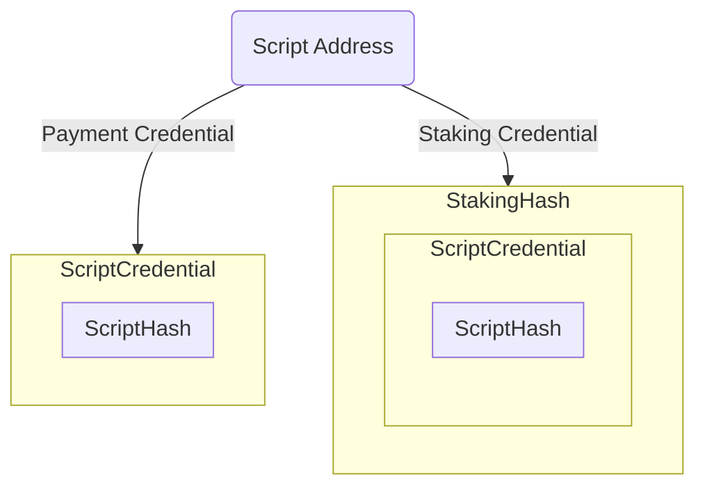
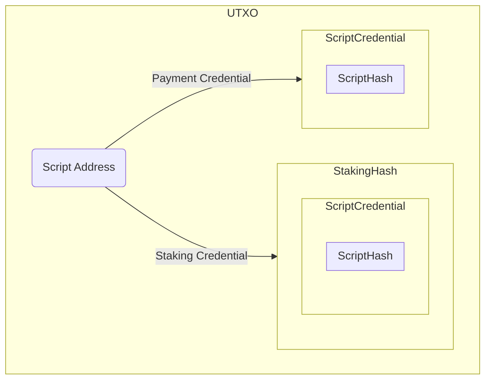
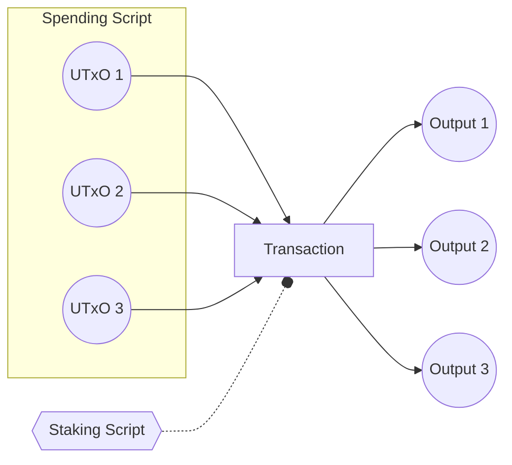
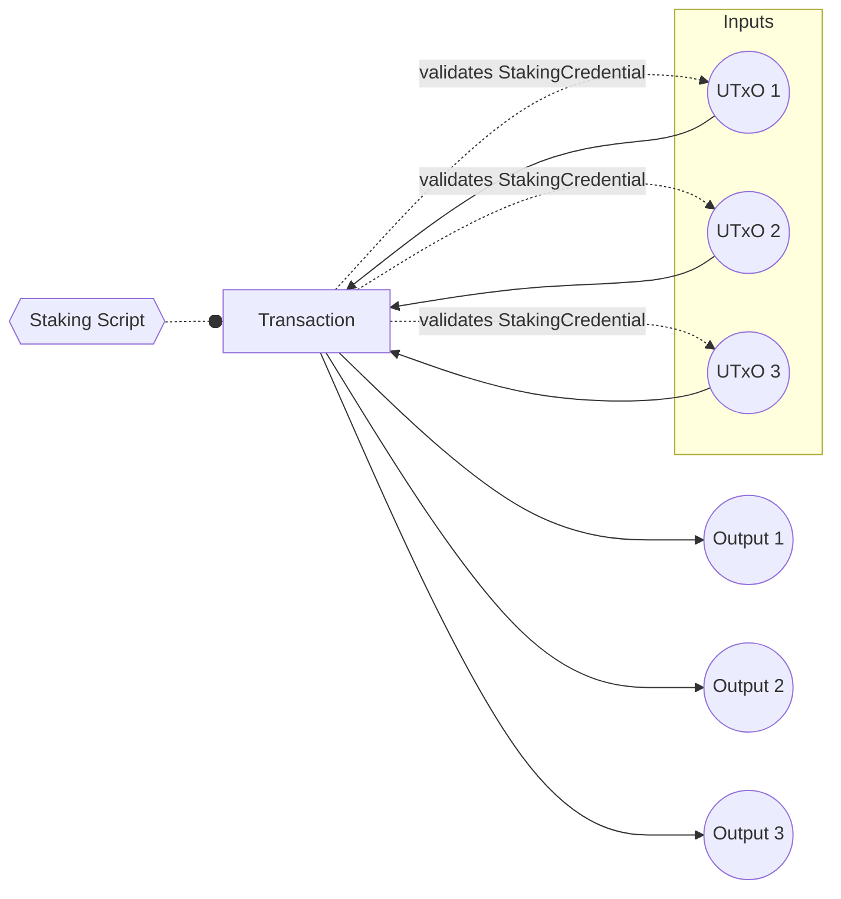

# Stake Validator Design pattern

## Table of Contents

- [Stake Validator Design pattern](#stake-validator-design-pattern)
  - [Table of Contents](#table-of-contents)
  - [How to use this document](#how-to-use-this-document)
  - [Introduction](#introduction)
  - [Main Features](#main-features)
  - [Why Staking Validators?](#why-staking-validators)
  - [Cardano model](#cardano-model)
  - [Address type](#address-type)
  - [Script Address](#script-address)
  - [Implementation](#implementation)

## How to use this document
The documentation is organized sequentially, starting with basics and progressing to advanced topics for
building your smart contract application.
You can read it in any order or directly access pages relevant to your use case. 
A table of contents on the top facilitates easy navigation between sections.


> It is important to note that all types and functions will be exclusively defined in PlutusTx.
This approach aims to establish a common foundation, especially in the context of the growing variety of languages such as Plutarch, Aiken, etc.

## Introduction
In this comprehensive guide, you will discover how to strategically implement the Staking Validator design pattern to enhance your protocol's performance and introduce composability by employing the innovative "withdraw zero trick." 


## Main Features
- receive staking rewards
- withdraw staking rewards


##  Why Staking Validators?

Consider a scenario with multiple UTXOs at a `Spending Validator`; if your entire protocol logic resides within it, the logic has to run for each UTXO, quickly reaching transaction limits and increasing CPU and memory usage.

The solution involves the `Spending Validator` checking that the `Staking validator` is called in the same transaction, consolidating the logic to run once at the `Staking Validator`. This significantly reduces script size and simplifies business logic.

`Staking Validators` play a crucial role, not only in adding logic to stake control but also in minimizing script size and optimizing CPU and memory usage. 
It's essential to note that staking validators aren't a one-size-fits-all solution; careful evaluation is needed to determine if this design pattern aligns with your specific purpose.

## Cardano model
Cardano is composed of two model
- The Extended Unspent Transaction Output (EUTXO) model:
    - each unspent output is linked to a specific address. 
    - the spending of this input is controlled by the payment credential
- The Accounting model (Staking):
    - Each utxo can be associated with an address containing a staking credential
    - Staking credential owners have control over delegation and possess the capability to withdraw rewards.

## Address type
Cardano address consists of two crucial components.
 - Payment Credential
    - Controls the spending of the UTXO associated with the payment credential address.
 - Staking Credential
    - Controls the registration, de-registration, delegation, and withdrawal of rewards 
> Note: While it is possible to construct addresses without a staking credential, this document will not delve into that aspect.

## Script Address
Addresses are not only used in wallet, but also in smart contracts, often referred to as scripts.

One can created a script address by hashing the Spending Validator and the Staking Validator. 



UTXO are associated with an Address with both components `Payment Credential` and `Staking Credential`


## Implementation

The strategy involves enforcing the spending validator to invoke the staking validator upon each attempted expenditure of the script input.
Following this, the staking validator assumes the responsibility of validating each spending script input to ensure strict adherence to the protocol specifications.



From the transaction we are going to specifically focus on the `ScriptContext`
This shared context is accessible to all validators within the transaction, enabling the enforcement of certain conditions, such as the presence of the `Staking Validator`.

Specifically, every `Spending Validator` is mandated to verify the existence of the `Staking Validator` within the transaction.

Consider the definition of the `ScriptContext` data type:

```haskell
data ScriptContext = 
  ScriptContext 
    { scriptContextTxInfo :: TxInfo
    , scriptContextPurpose :: ScriptPurpose 
    }
```

Within the `TxInfo` type, note the importance of the `txInfoWdrl` field.
This field encapsulates a Map where each `StakingCredential` serves as a key, paired with its corresponding withdrawal amount as the associated value.

```haskell
data TxInfo = TxInfo
    { txInfoInputs          :: [TxInInfo] -- ^ Transaction inputs
    , txInfoReferenceInputs :: [TxInInfo] -- ^ Transaction reference inputs
    , txInfoOutputs         :: [TxOut] -- ^ Transaction outputs
    , txInfoFee             :: Value -- ^ The fee paid by this transaction.
    , txInfoMint            :: Value -- ^ The 'Value' minted by this transaction.
    , txInfoDCert           :: [DCert] -- ^ Digests of certificates included in this transaction
    , txInfoWdrl            :: Map StakingCredential Integer -- ^ Withdrawals
    , txInfoValidRange      :: POSIXTimeRange -- ^ The valid range for the transaction.
    , txInfoSignatories     :: [PubKeyHash] -- ^ Signatures provided with the transaction, attested that they all signed the tx
    , txInfoRedeemers       :: Map ScriptPurpose Redeemer
    , txInfoData            :: Map DatumHash Datum
    , txInfoId              :: TxId -- ^ Hash of the pending transaction (excluding witnesses)
    }
```

To implement this validation requirement, a parameterized `Spending Validator` is created as follows:

```haskell
mkValidator :: StakingCredential -> Datum -> Redeemer -> ScriptContext -> Bool
mkValidator stakingCred _datum _redeemer context =
  case PlutusTx.AssocMap.lookup stakingCred $ txInfoWdrl txinfo of
    Just _ -> True
    Nothing -> PlutusTx.Prelude.error ()
  where
    txinfo = scriptContextTxInfo context
```
This `Spending Validator` checks if the specified StakingCredential is present in the `txInfoWdrl` field of the transaction, ensuring the required presence of the `Staking Validator` for validation purposes."

> Note: Please be aware that this validator serves as a reference only. There might be instances where your protocol does not necessarily require the staking validator to be present. This is particularly applicable in situations where, for example, you aim to facilitate a user's withdrawal of assets through the script. In such cases, the primary validation is ensuring that the user is appropriately signing the transaction.




WIP ...