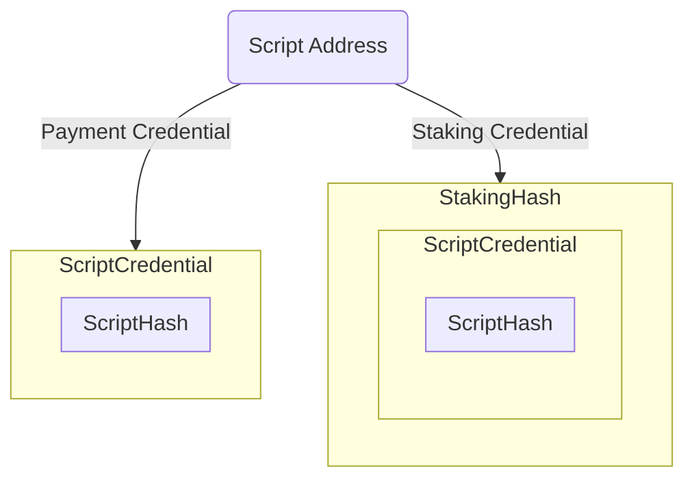
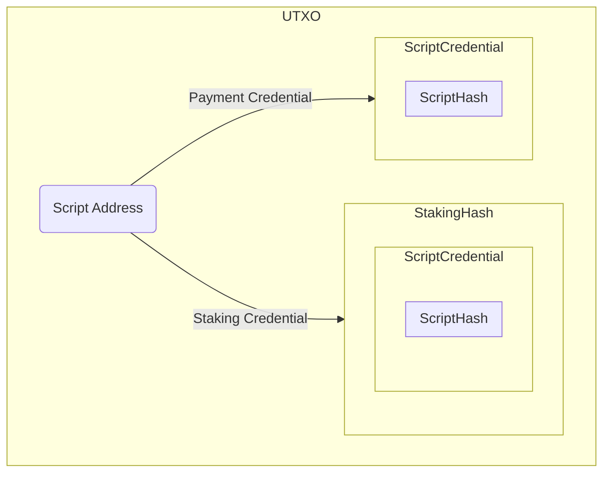
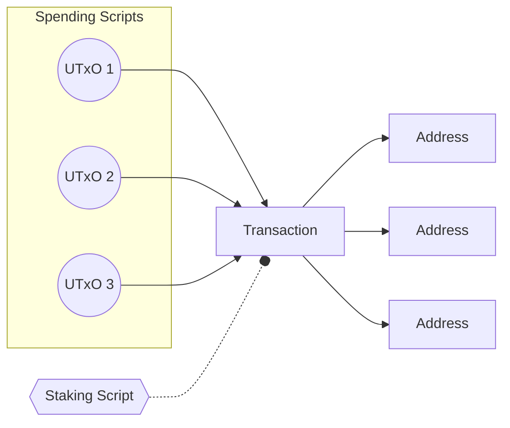

# Stake Validator Design pattern

In this comprehensive guide, you will discover how to strategically implement the Staking Validator design pattern to enhance your protocol's performance and introduce composability by employing the innovative "withdraw zero trick." 

Staking validators play a central role not only in minimizing the script size of a spending validator but also in optimizing CPU and memory utilization. 

This document provides detailed insights and practical steps to leverage this pattern effectively, empowering you to elevate the efficiency and composability of your protocol.
## Table of Contents

- [Stake Validator Design pattern](#stake-validator-design-pattern)
  - [Table of Contents](#table-of-contents)
  - [Introduction](#introduction)
  - [Cardano model](#cardano-model)
  - [Address type](#address-type)
  - [Script Address](#script-address)
  - [Implementation](#implementation)

## Introduction

In Cardano's Proof-of-Stake (PoS), ADA holders through delegation can assign the responsibility of block creation to a chosen pool.
In return delegators are rewarded with a share of the pool's earnings,this earnings are accrued in their staking account.

## Cardano model
Cardano is composed of two model
- The Extended Unspent Transaction Output (EUTXO) model:
    - each unspent output is linked to a specific address. 
    - the spending of this input is controlled by the payment credential
- The Accounting model (Staking):
    - Each utxo can be associated with an address containing a staking credential
    - Staking credential owners have control over delegation and possess the capability to withdraw rewards.

## Address type
Cardano address consists of two crucial components.
 - Payment Credential
    - Controls the spending of the UTXO associated with the payment credential address.
 - Staking Credential
    - Controls the registration, de-registration, delegation, and withdrawal of rewards 
> Note: While it is possible to construct addresses without a staking credential, this document will not delve into that aspect.

## Script Address
Addresses are not only used in wallet, but also in smart contracts, often referred to as scripts.

One can created a script address by hashing the Spending Validator and the Staking Validator. 

UTXO are associated with an Address with both components `Payment Credential` and `Staking Credential`

## Implementation

The strategy involves enforcing the spending validator to invoke the staking validator upon each attempted expenditure of the script input.
Following this, the staking validator assumes the responsibility of validating each spending script input to ensure strict adherence to the protocol specifications.

WIP ...