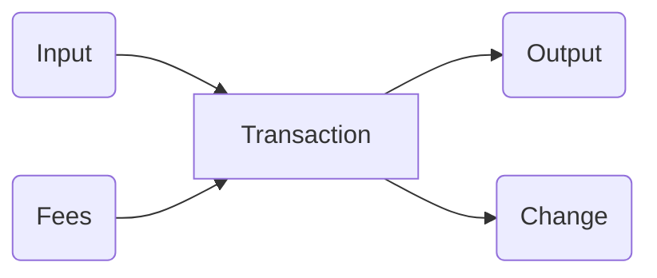
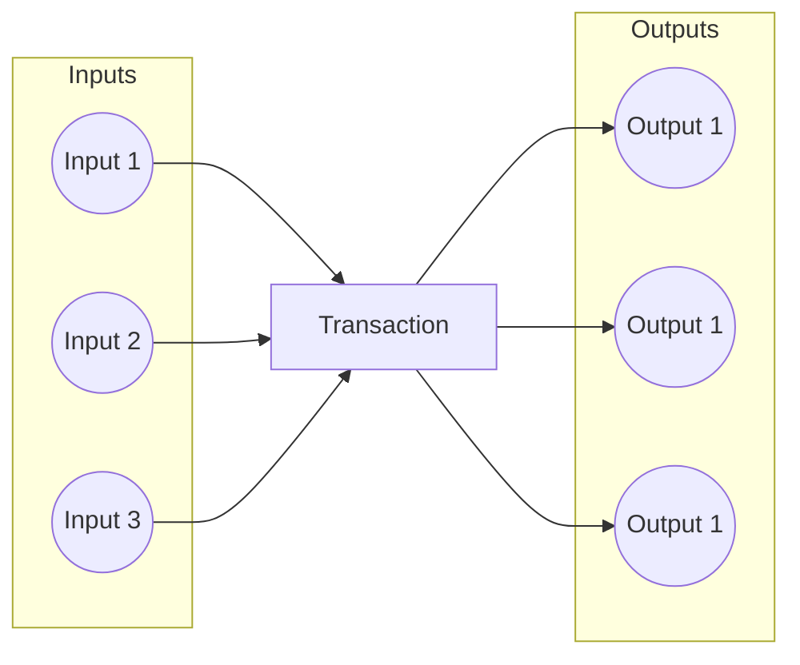

# UTxO Indexer Design Pattern

Enhancing Smart Contract Validation on Cardano Introduction In the Cardano blockchain, the UTxO
(Unspent Transaction Output) model is fundamental to the functioning of smart contracts. The UTxO
model defines how transactions are structured, with inputs consuming existing UTxOs and producing
new ones as outputs. This article explores the UTxO Indexer design pattern, focusing on its
application to streamline the validation process for more complex transactions.

## Singular Input Processing

The foundational concept of smart contract validation in Cardano begins with singular input
processing. In its simplest form, validators, or smart contracts, are designed to validate
transactions that consist of a single input and optionally a single output. The following
illustrates this basic structure:



This straightforward scenario provides a clear validation path, making it relatively simple for the
smart contract to verify and process the transaction.

## Multiple Inputs and Outputs

However, as the need for increased throughput arises, smart contracts may require the ability to
handle multiple inputs and outputs within a single transaction. This batch processing capability can
significantly improve efficiency. Consider the following example:



While this approach enhances throughput, it introduces a challenge for the validator. Determining
how inputs and outputs are paired and the order in which they should be processed becomes complex
and potentially costly.

## UTxO Indexes in Redeemer

To address the challenges posed by multiple inputs and outputs, the UTxO Indexer design pattern
introduces the use of UTxO indexes within the redeemer. The redeemer is a component of a transaction
that carries additional data required for smart contract validation. In this context, the indices of
the inputs and outputs are included in list fields within the redeemer.

```haskell
data Redeemer = Redeemer
  { inputs  :: [Integer]
  , outputs :: [Integer]
  }
```

By incorporating UTxO indexes in the redeemer, the validator gains the ability to more effectively
sort and pair inputs and outputs during the validation process. Additionally, the validator can
ensure that no input or output is used more than once, and that indices are not missing, thereby
enhancing the integrity of the transaction validation.

The implementation to be presented in this repository aims to tackle all the checks mentioned above,
the pattern usually is integrated with a transaction level validation pattern ("Transaction level
validation for spending validators via stake validators using the withdraw zero trick" or
"Transaction level validation for spending validators via minting policies") to achieve the best
possible throughput.

## Conclusion

The UTxO Indexer design pattern offers a powerful solution to the challenges posed by transactions
with multiple inputs and outputs. By leveraging UTxO indexes within the redeemer, smart contracts on
the Cardano blockchain can achieve greater throughput without compromising on the efficiency and
integrity of the validation process. This pattern exemplifies the adaptability and scalability of
smart contract design in the evolving landscape of blockchain technologies.