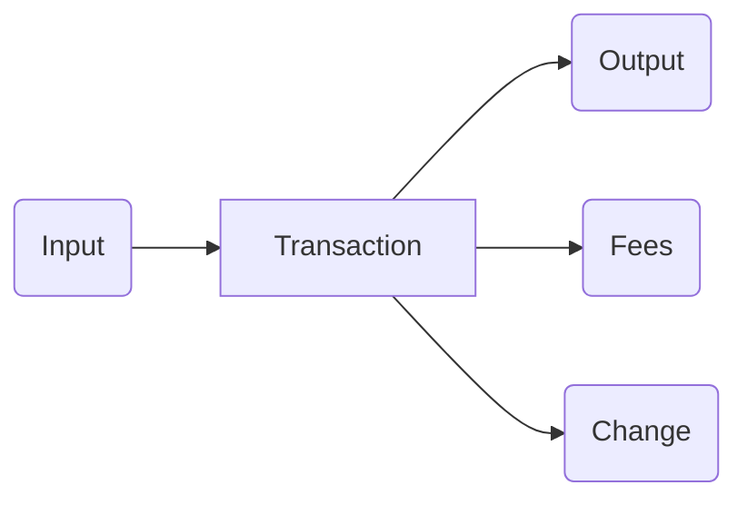
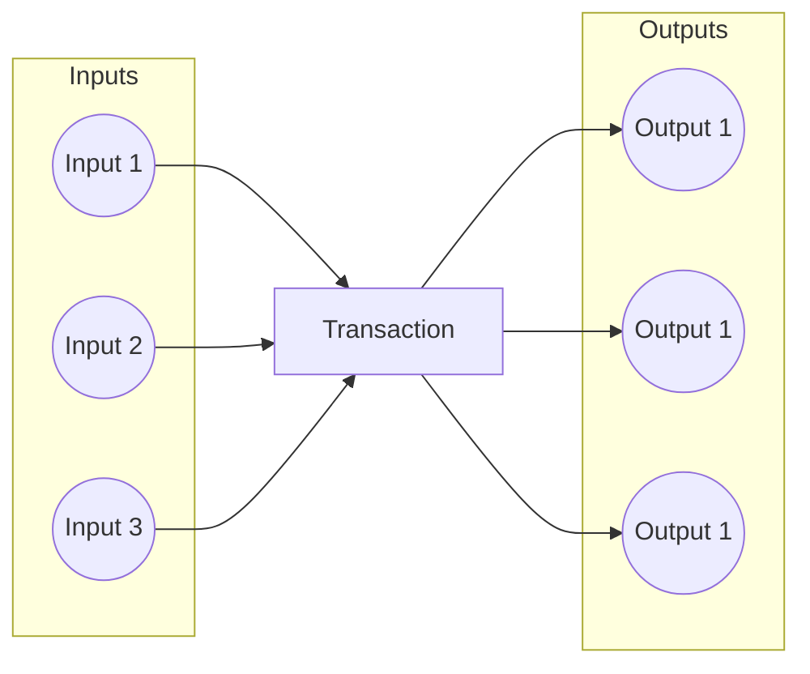

# UTxO Indexer Design Pattern: Enhancing Smart Contract Validation on Cardano 

## Introduction 

In the Cardano blockchain, the UTxO (Unspent Transaction Output) model is fundamental to the functioning of smart contracts. 
The UTxO model defines how transactions are structured, consuming existing UTxOs as inputs and producing
new ones as outputs. This article explores the UTxO Indexer design pattern, focusing on its
application to streamline the validation process for complex transactions.

## Singular Input Processing

The foundational concept of smart contract validation in Cardano begins with singular input
processing. In its simplest form, validators, or smart contracts, are designed to validate
transactions that consist of a single input and optionally a single output. The following
illustrates this basic structure:



This straightforward scenario provides a clear validation path, making it relatively simple for the
smart contract to verify and process the transaction.

The code for the validator in this case would be something like this:

```haskell
validatorA :: Datum -> Redeemer -> ScriptContext -> Bool
validatorA datum redeemer context =
  let input    = findOwnInput         context
      [output] = getContinuingOutputs context
  in  validateWithInputOutput input output
    where
    findOwnInput :: ScriptContext -> Maybe TxInInfo
    findOwnInput ScriptContext{scriptContextTxInfo=TxInfo{txInfoInputs},                   
                           scriptContextPurpose=Spending txOutRef} =
        find (\TxInInfo{txInInfoOutRef} -> txInInfoOutRef == txOutRef) txInfoInputs
    findOwnInput _ = Nothing
```
Note that `findOwnInput` checks the `TxOutRef` of each input to identify the one currently being validated. In this case, the check (comparing `TxOutRef`) is relatively cheap, even so, the actual search is very expensive since in the worst-case we traverse the entire list of inputs and check each one. Furthermore, often you will want to search for an input / output with more complex criteria ie:

```haskell
validatorB :: AssetClass -> BuiltinData -> BuiltinData -> ScriptContext -> Bool
validatorB stateToken _ _ ctx =
  let authInput  = findAuth ctx  
      goodOutput = findOutputWithCriteria ctx
   in validate authInput goodOutput
    where
    findAuth :: ScriptContext -> Maybe TxInInfo
    findAuth ScriptContext{scriptContextTxInfo=TxInfo{txInfoInputs}} =
      find (\TxInInfo{txInOutput} -> assetClassValueOf stateToken (txOutValue txInOutput) == 1) txInfoInputs

    findOutputWithCriteria :: ScriptContext -> Maybe TxInInfo
    findOutputWithCriteria ScriptContext{scriptContextTxInfo=TxInfo{txInfoOutputs}} =
      find (\txOut -> criteria txOut) txInfoOutputs 
```

Using the redeemer indexing design pattern we can avoid needing to make these checks for each input / output, instead we pass the index of the input / output we are looking into the redeemer then we just make our checks for the element at that index:
```haskell
validatorA :: AssetClass -> BuiltinData -> Integer -> ScriptContext -> Bool 
validatorA stateToken _ tkIdx ctx =
  assetClassValueOf stateToken (txInInfoResolved (elemAt tkIdx (txInfoInputs (txInfo ctx)))) == 1  
```

This design pattern can complicate the construction of the redeemer in off-chain code because the input index (corresponding to a given UTxO) that you define in the redeemer often will not index the correct UTxO after balancing / coin-selection since new inputs will be added to the transaction. Luckily [lucid-evolution](https://github.com/Anastasia-Labs/lucid-evolution) provides a high-level interface that abstracts all the complexity away and makes writing offchain code for this design pattern extremely simple! 

To construct the redeemer for `validatorA` with [lucid-evolution](https://github.com/Anastasia-Labs/lucid-evolution):
```typescript
  //  policy id and asset name in Hex of the state token.
  const stateTokenId = toUnit(STATE_TOKEN_CS, STATE_TOKEN_NAME)
  // Query the UTxO that contains the state token
  const authUTxO = await lucid.utxoByUnit(stateTokenId);
  // Construct the redeemer to be the index of the authUTxO in the transaction inputs list. 
  const validatorARedeemer: RedeemerBuilder = {
    kind: "selected",
    // the function that constructs the redeemer using inputIndices, the list of indices
    // corresponding to the UTxOs defined as inputs below. 
    makeRedeemer: (inputIndices: bigint[]) => {
      return Data.to(inputIndices[0]);
    },
    // the inputs that are relevant to the construction of the redeemer in this case our
    // redeemer only cares about the index of the input that contains the auth token. 
    inputs: [authUTxO],
  };
```
For a complete example check the examples included in the current directory. 

## Multiple Inputs and Outputs

However, as the need for increased throughput arises, smart contracts may require the ability to
handle multiple inputs and outputs within a single transaction. This batch processing capability can
significantly improve efficiency. Consider the following example:



While this approach enhances throughput, it introduces a challenge for the validator. Determining
how inputs and outputs are paired and the order in which they should be processed becomes complex
and potentially costly.

To avoid unintended consequences, the following vulnerabilities must be considered:
- Multiple satisfaction: a single output (or input) can be paired with multiple inputs, which
  individually satisfies the validator, but in a whole can lead to value being lost (stolen).
- Unaccounted outputs: while the validator functions are executed for all inputs, there are no
  checks that are ocurring implicitly for outputs, hence adding more unforeseen outputs to an
  otherwise valid transaction can lead to unexpected/unwanted behaviour.
- Other vulnerabilities are also possible, of course,
  [here](https://library.mlabs.city/common-plutus-security-vulnerabilities) is a good article to
  most of the uncovered ones.

## UTxO Indices in Redeemer

To address the challenges posed by multiple inputs and outputs, the UTxO Indexer design pattern
introduces the use of UTxO indices within the redeemer. The redeemer is a component of a transaction
that carries additional data required for smart contract validation. In this context, the indices of
script inputs and their corresponding outputs are included within the redeemer.

```haskell
data MyRedeemer = MyRedeemer
  { ioIndices :: [(Integer, Integer)] -- [(inputIndex, outputIndex)]
  }

validator :: Datum -> MyRedeemer -> ScriptContext -> Bool
validator datum redeemer context =
  all validateWithIndices indices && allIndicesAccountedFor indices
 where
  indices = ioIndices redeemer
  txInfo  = scriptContextTxInfo context
  inputs  = txInfoInputs  txInfo
  outputs = txInfoOutputs txInfo
  validateWithIndices (inputIndex, outputIndex) =
    let input  = inputs `elemAt` inputIndex
        output = outputs `elemAt` outputIndex
    in  validateWithInputOutput input output
```

By incorporating UTxO indices in the redeemer, the validator gains the ability to more effectively
sort and pair inputs and outputs during the validation process. Additionally, the validator needs to
ensure that no input or output is used more than once, and that indices are not missing.

To achieve this, the implementation to be presented in this repository aims to tackle all the checks
mentioned above, and the pattern is integrated with a transaction level validation pattern
("Transaction level validation for spending validators via stake validators using the withdraw zero
trick" or "Transaction level validation for spending validators via minting policies") to achieve
the best possible throughput.

Also, while the ordering of outputs are preserved (the validator gets them in the same order, in
which the builder of the transaction provided them), the inputs are re-ordered before the validator
receives them. The good news is that this re-ordering is deterministic, it can be taken into account
by the transaction builder before sending the transaction to a node for inclusion in the blockchain.
The inputs are ordered by the id of the UTxO (which consists of the creating transaction hash and the
index of its output) lexicographically, first by transaction hash and then by output index. For the 
transaction builder to determine the indices of the inputs, it needs to order them in the same way 
before creating the redeemer.

## Conclusion

The UTxO Indexer design pattern offers a powerful solution to the challenges posed by transactions
with multiple inputs and outputs. By leveraging UTxO indices within the redeemer, smart contracts on
the Cardano blockchain can achieve greater throughput without compromising on the efficiency and
integrity of the validation process. This pattern exemplifies the adaptability and scalability of
smart contract design in the evolving landscape of blockchain technologies.
